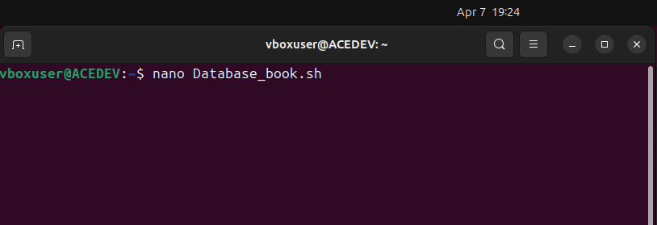
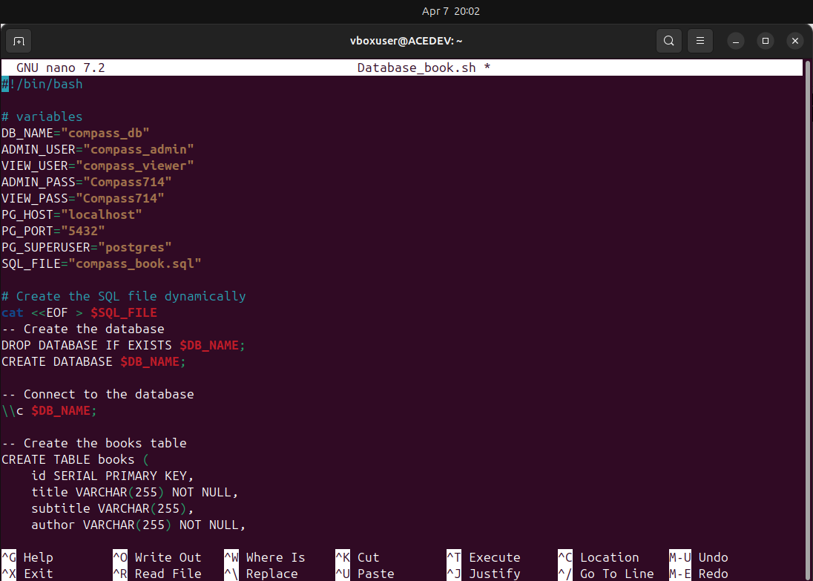
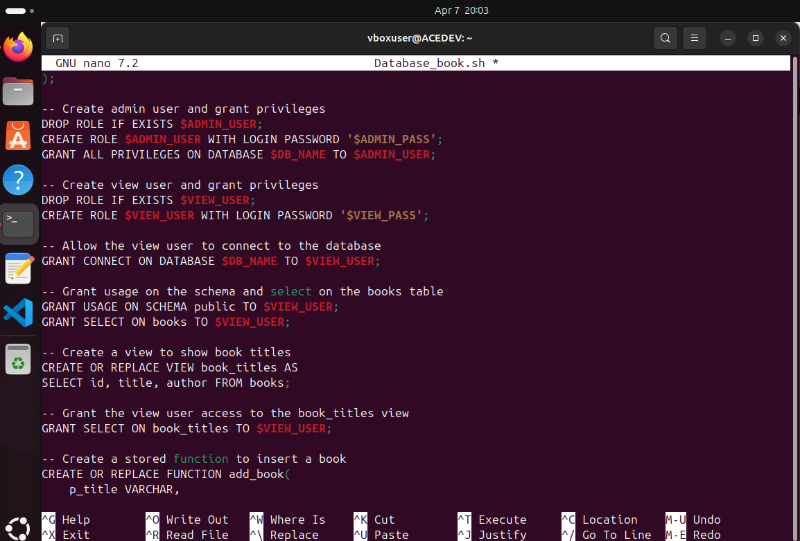
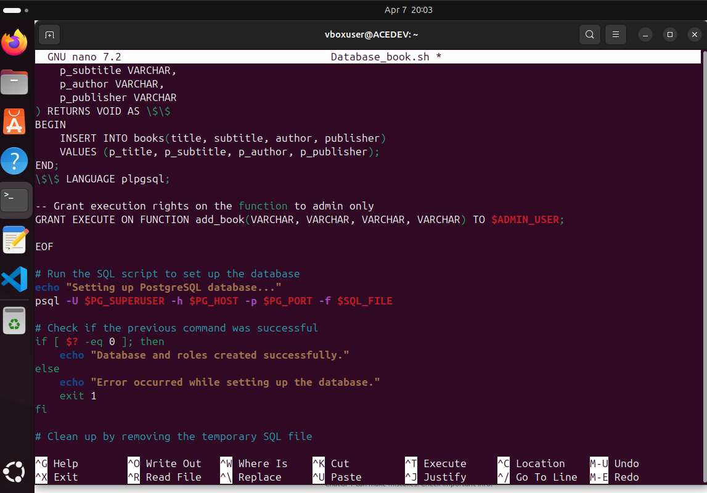
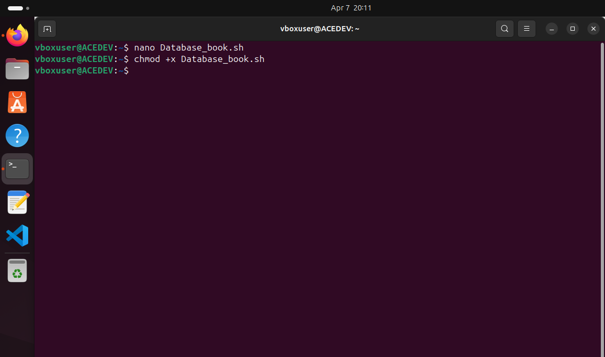
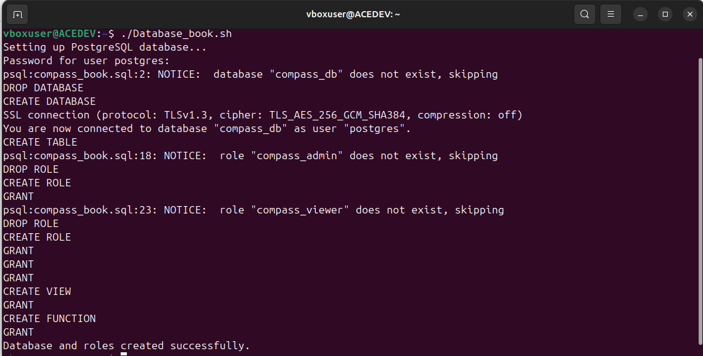
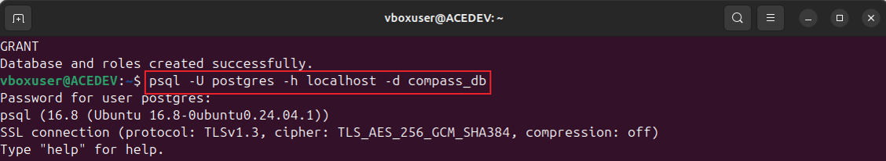
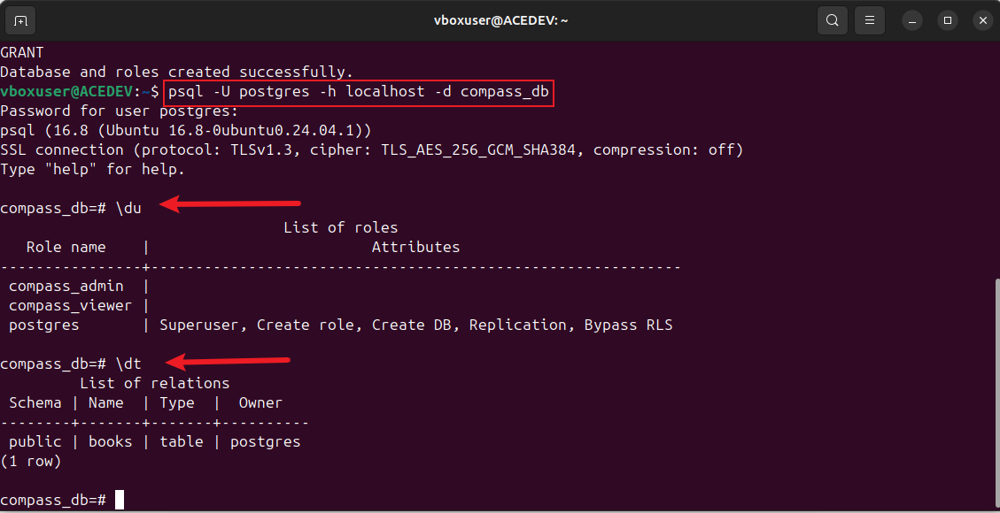
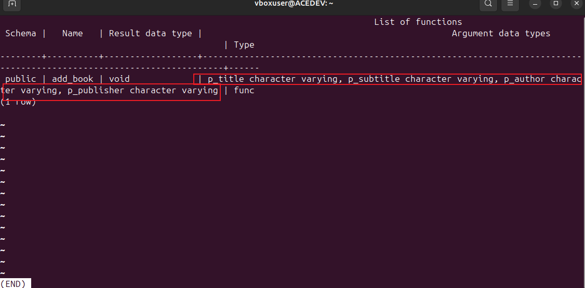
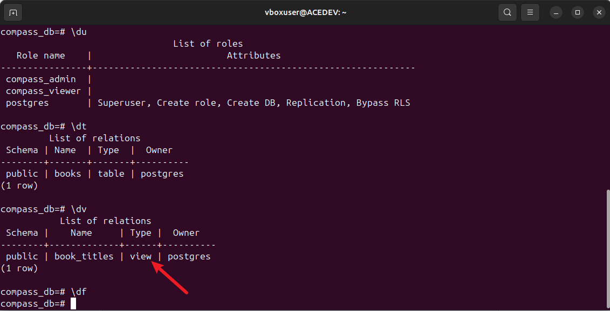

# Compass-Mining-Book
Writing a bash script and the supporting PostgreSQL to do the following:
*Create a new Database and tables, which should be designed to contain info about books (Title, sub title, author and publisher),
*Create an admin users and view user for the above DB.
*Create at least one function or procedure and at least one view for above admin and/or users.

## STEP 1
creating a bash script file (Database.sh)

## STEP 2
The bash cript to execute the above given instructions:

    #!/bin/bash

    # variables

    DB_NAME="compass_db"
    ADMIN_USER="compass_admin"
    VIEW_USER="compass_viewer"
    ADMIN_PASS="ADEteye123"
    VIEW_PASS="ADEteye123"
    PG_HOST="localhost"
    PG_PORT="5432"
    PG_SUPERUSER="postgres"
    SQL_FILE="compass_book.sql"

    #  Create the SQL file dynamically

    cat <<EOF > $SQL_FILE
    # Create the database
    DROP DATABASE IF EXISTS $DB_NAME;
    #  CREATE DATABASE $DB_NAME;

    # Connect to the database           
    \\c $DB_NAME;

    # Create the books table
    CREATE TABLE books (
    id SERIAL PRIMARY KEY,
    title VARCHAR(255) NOT NULL,
    subtitle VARCHAR(255),
    author VARCHAR(255) NOT NULL,
    publisher VARCHAR(255) NOT NULL
     );

    #  Create admin user and grant privileges 
    DROP ROLE IF EXISTS $ADMIN_USER;
    CREATE ROLE $ADMIN_USER WITH LOGIN PASSWORD '$ADMIN_PASS';
    GRANT ALL PRIVILEGES ON DATABASE $DB_NAME TO $ADMIN_USER;

    #  Create view user and grant privileges 
    DROP ROLE IF EXISTS $VIEW_USER;
    CREATE ROLE $VIEW_USER WITH LOGIN PASSWORD '$VIEW_PASS';

    #  Allow the view user to connect to the database
    GRANT CONNECT ON DATABASE $DB_NAME TO $VIEW_USER;

    # Grant usage on the schema and select on the books table
    GRANT USAGE ON SCHEMA public TO $VIEW_USER;
    GRANT SELECT ON books TO $VIEW_USER;

    #  Create a view to show book titles
    CREATE OR REPLACE VIEW book_titles AS
    SELECT id, title, author FROM books;

    # Grant the view user access to the book_titles view
    GRANT SELECT ON book_titles TO $VIEW_USER;

    # Create a stored function to insert a book
    CREATE OR REPLACE FUNCTION add_book(
    p_title VARCHAR,
    p_subtitle VARCHAR,
    p_author VARCHAR,
    p_publisher VARCHAR) 
    RETURNS VOID AS \$\$
    BEGIN    INSERT INTO books(title, subtitle, author, publisher)
    VALUES (p_title, p_subtitle, p_author, p_publisher);
    END;
    \$\$ LANGUAGE plpgsql;

    # Grant execution rights on the function to admin only
    GRANT EXECUTE ON FUNCTION add_book(VARCHAR, VARCHAR, VARCHAR, VARCHAR) TO $ADMIN_USER;

    EOF

    Run the SQL script to set up the database

    echo "Setting up PostgreSQL database..."
 
    psql -U $PG_SUPERUSER -h $PG_HOST -p $PG_PORT -f $SQL_FILE
 
    Check if the previous command was successful

    if [ $? -eq 0 ]; then  
       
          echo "Database and roles created successfully."

    else
          
           echo "Error occurred while setting up the database."

    exit 1

    fi

    Clean up by removing the temporary SQL file

    rm -f $SQL_FILE

## STEP 3
The file is made executable using the "chmod + " command

afterwhich i execute the  bash script file (Database_book.sh) which shows the databaseand roles where created successfully

## STEP 4
Output of the tasks (PostgreSQL):

Using the command prompt "psql -u postgres -h localhost -d compass_db" to connect to the PostgresSQL database and verify that the database, tables, roles, views, and functions were created as expected. Using psql to connect to compass_db and list the tables, roles, and views:

* Create an admin users and view user for the above DB

 "du": To check the list roles created where it shows the admin users (compass_admin) and view user (compass_viewer)

* Create at least one function 

"df": To  displays the information in the book: Title, sub title, author and publisher

* create least one view for above admin and/or users  
"du": shows the roles
"dt": shows the table
"dv": shows one view of the user

 